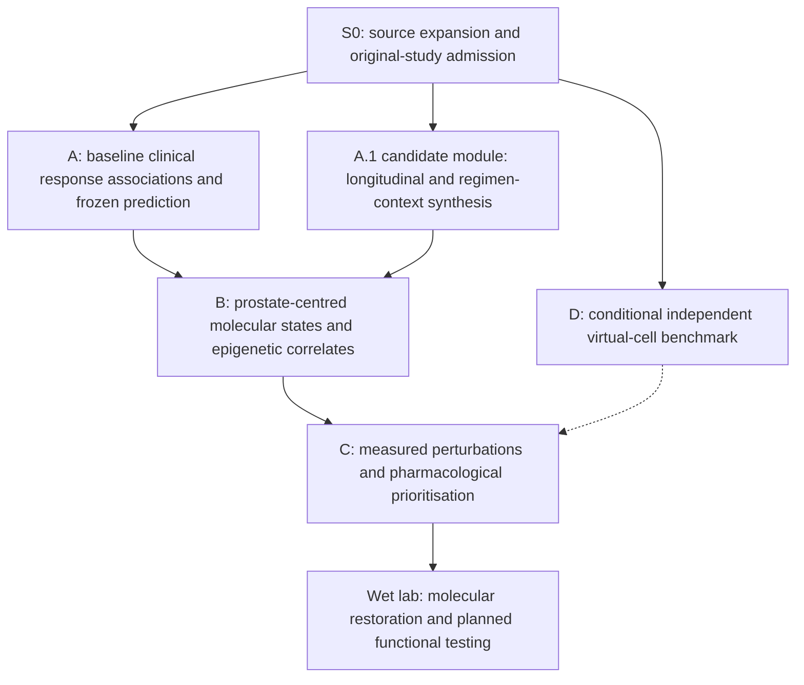

# Start here: thesis evidence, analysis and publication roadmap

**12 September 2026 | Review draft | Documentation and specifications only**

This roadmap converts the user's requested expansion into bounded work. It does not report new patients, biological results, a completed literature search, external review, protocol approval or an implemented expanded pipeline. Baseline inspected: `a8278c776da7c6b096cc14139d729979db286b50`.

## The one scientific story

Identify reproducible pretreatment immune-expression programmes associated with objective response to immune checkpoint inhibitors across independent cohorts; assess their predictive and biological transferability; and provide a prespecified clinical reference for investigating prostate immune deficits and epigenetic restoration.

On-treatment and genuinely post-treatment observations strengthen the longitudinal evidence. They do not enter a predictor advertised for use before treatment.

**How to read the arrows:** they transfer evidence products, not proof of causality. B's existing fixed antigen-presentation module can proceed independently of A. A-derived B analyses need A's frozen development-only product. D does not replace measured perturbations or experiments.

## What belongs where?

| Workstream | Main question | Required distinction |
|---|---|---|
| S0 shared kit | Which original studies, processed objects and linked samples actually support each analysis? | Resources, accessions, studies, patients and assays are different denominators. S0 is not an extra paper. |
| A | What baseline programmes associate reproducibly with observed ICI response? | Biological effect estimates are separate from classifier coefficients. Existing A-P2 remains the selected primary. |
| A.1 candidate | How do programmes change with exposure, response group, drug and class? | A longitudinal module first; a separate publication only after feasibility and non-overlap review. Not an automatically valid network meta-analysis. |
| B | Where do those programmes occur in prostate and qualified comparator cancers, and what regulatory evidence accompanies them? | Molecular stratification, not observed TCGA ICI response. Existing B-P is preserved inside its fixed APM module. |
| C | Which measured interventions restore supported programmes in relevant models? | Reversal, viability, protein restoration, immune function and clinical benefit are different evidence levels. |
| D | Do model predictions beat informative baselines on an independent compatible perturbation dataset? | Conditional benchmark; no substitution for missing measurements. |

## The immediate task

**Do X0 and X1 first:** inventory reusable legacy components and construct the expanded original-study/source coverage report. Do not start all omics analyses at once. Use [Codex prompt 1](specs/S0_EVIDENCE_EXPANSION/CODEX_PROMPTS.md#prompt-1-source-expansion-and-legacy-reuse).

The first handback must contain a deduplicated study roster, a modality/timepoint/endpoint coverage table, access and processed-data status, a legacy reuse assessment, a development/test exposure ledger, and a short list of the exact decisions needed next. Unavailable sources stay visible. No guessed sample totals.

After that: approve source-specific measurement and analysis contracts; implement a bounded vertical slice; validate it; then scale. The existing one-production-paper-at-a-time rule is unchanged. Source inventory can cover all papers without launching all analyses.

## Five durable rules

1. **Processed first.** No FASTQ/BAM, IDAT, raw mass-spectrometry or raw imaging reprocessing in this expansion. Author/GDC count matrices are acceptable processed products and are not raw sequencing reads.
2. **Original study first.** ICBatlas and other catalogues discover data; mirrors and reanalyses do not create new patients.
3. **Question first.** Each added assay must answer a named question. No requirement for a complete all-omics intersection before the RNA backbone proceeds.
4. **Frozen clinical reference first.** A's development-derived genes, directions, transforms and predictions are versioned before reserved-test inspection; all specimens of test patients stay out of discovery.
5. **Evidence before publication count.** Three core papers plus conditional D remain the programme. A.1 is a candidate extension, not a promised fifth manuscript.

## Navigation

- [Shared expansion kit and reading order](specs/S0_EVIDENCE_EXPANSION/README.md)
- [Data and matching rules](specs/S0_EVIDENCE_EXPANSION/DATA_CONTRACT.md)
- [A: biological discovery and prediction](specs/S0_EVIDENCE_EXPANSION/A_BIOLOGICAL_DISCOVERY.md)
- [A.1: longitudinal, pharmacological and meta-analysis logic](specs/S0_EVIDENCE_EXPANSION/A1_LONGITUDINAL_META.md)
- [B: TCGA, stage and multi-omics](specs/S0_EVIDENCE_EXPANSION/B_TCGA_MULTIOMICS.md)
- [Cell composition, single-cell and spatial evidence](specs/S0_EVIDENCE_EXPANSION/CELLULAR_SPATIAL.md)
- [C/D extension boundaries](specs/S0_EVIDENCE_EXPANSION/CD_PERTURBATION.md)
- [Tasks, acceptance and figures](specs/S0_EVIDENCE_EXPANSION/TASKS.md)
- [Codex prompts and connector policy](specs/S0_EVIDENCE_EXPANSION/CODEX_PROMPTS.md)
- [Primary references, source leads and novelty](specs/S0_EVIDENCE_EXPANSION/REFERENCES_AND_NOVELTY.md)
- [Decision and protocol crosswalk](docs/decisions/EXPANSION_20260912_PROPOSED.md)

GitHub supports the Mermaid blocks in Markdown; these are **design diagrams**, not graphs of study results. See the [official documentation](https://docs.github.com/en/get-started/writing-on-github/working-with-advanced-formatting/creating-diagrams).
