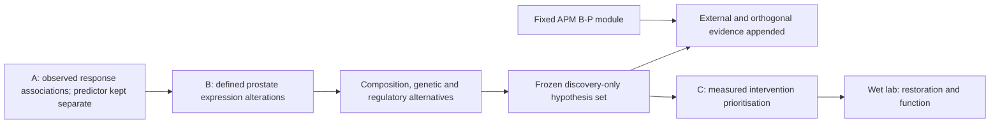

# Paper B scientific revision — review kit

28 September 2026 · PROPOSED · Not a scientific freeze or permission to run biological analyses.

Baseline: `a8278c776da7c6b096cc14139d729979db286b50` on `main`. The separate open draft PR #6, head `48373c5eae2c6e22dc9a53b54f6cfc84bf969d54`, is an inspected proposal, not a merged dependency. This kit does not overwrite existing decisions, analysis contracts, software, or historical receipts.

## Recommended paper

**Clinically anchored immune programmes and their regulatory correlates in prostate cancer.**

Identify prostate immune-expression alterations connected to reproducible clinical ICI-response associations, distinguish composition from candidate regulatory explanations, and nominate explicitly uncertain restoration hypotheses. Keep the fixed APM B-P prediction experiment as the sole existing confirmatory estimand, not as the entire paper.

The accepted 11 September A/B amendment already establishes this hierarchy. This review does not newly demote B-P, replace it, or approve an invented primary barrier score.

## Reading order and authority

1. [Scientific Revision Report](../../../docs/research/B_SCIENTIFIC_REVISION_20260928.md) — verdict, audit, aims, hypotheses, novelty, feasibility and publication assessment.
2. [Protocol crosswalk](PROTOCOL_CROSSWALK.md) — submitted commitments versus accepted amendments, proposals, software and biological evidence.
3. [Data and clinical contract](DATA_CONTRACT.md) plus [source manifest](sources.jsonl) — source-by-question architecture, units and UNKNOWN fields.
4. [Analysis contract](ANALYSIS_CONTRACT.md) — estimands, B-P audit, inference, multiplicity and claim ceilings.
5. [Composition and integration](COMPOSITION_INTEGRATION.md) — competing explanations, optional omics, donor-aware cellular/spatial work.
6. [Interfaces and validation](INTERFACES_VALIDATION.md) — A→B, discovery freeze, external validation, B→C and wet-lab nomination.
7. [Four-figure plan](FIGURES.md), [implementation and readiness](IMPLEMENTATION_READINESS.md), and [references](REFERENCES.md).
8. [Proposed decision](../../../docs/decisions/B_SCIENTIFIC_REVIEW_20260928_PROPOSED.md) and [audit scope](../../../docs/validation/B_scientific_review_20260928/AUDIT.md).

No file in this folder supersedes `specs/B/ANALYSIS.md` or the accepted decision ledger. A later approved reconciliation must update controlling documents and preserve their history. `UNKNOWN` is a blocker or claim restriction, never a default fabricated by an implementer.

These arrows transfer evidence, not causal identification. Review approval, source admission, scientific freeze, software validation and biological analysis are separate milestones.
