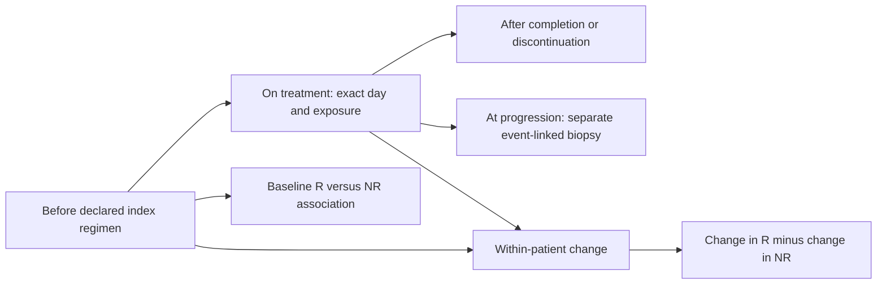
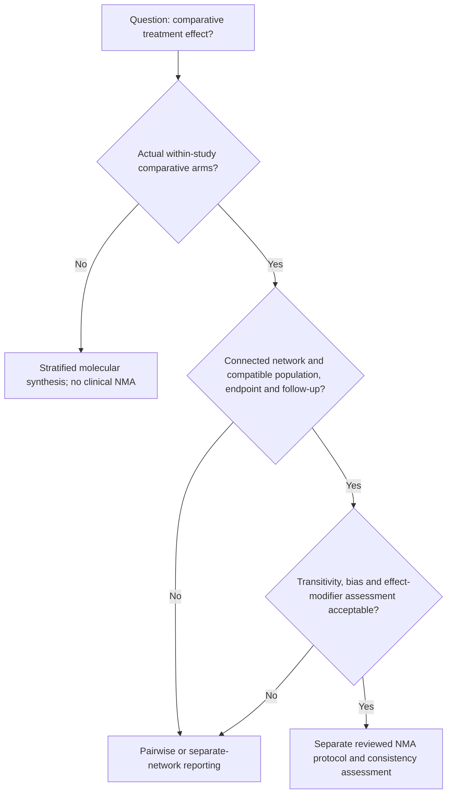

# A.1 candidate — Longitudinal and pharmacological-context synthesis

**Status:** proposed module of the clinical ICI programme. A separate manuscript is conditional on sufficient independent longitudinal evidence, a distinct estimand and non-overlapping substantive results. No clinical network meta-analysis is authorized by this proposal.

## 1. Separate time from response and exposure

An author's `post` label may mean after the first dose, not after treatment ended. Retain the literal label, actual date/day, reference event and canonical status separately. Unknown timing remains unknown. Pre-nivolumab after prior ipilimumab is not treatment-naive. Sequential priming, chemotherapy, steroids and combination components need their own exposure timeline.

## 2. Contrast registry

| Contrast ID | Exact question | Eligibility |
|---|---|---|
| `BASELINE_R_NR` | Baseline difference between patients later classified R and NR | Qualified pre-index samples and original endpoint |
| `ON_R_NR` | Difference at a specified on-treatment window | Comparable windows, known exposure; a pharmacodynamic association, not baseline prediction |
| `POST_R_NR` | Difference after a specified completion/discontinuation event | Event/timing established; progression-associated biopsies separate |
| `DELTA_R` | Mean within-patient on-minus-baseline change among R | Verified paired subjects and exposure |
| `DELTA_NR` | Corresponding change among NR | Verified paired subjects and exposure |
| `RESPONSE_TIME_INTERACTION` | Whether the paired change differs between R and NR | Both groups and estimable response-by-time structure |
| `ARM_TIME_INTERACTION` | Whether temporal change differs between actual treatment arms | Within-study comparative design; causal interpretation depends on allocation and selection |

Preserve legacy aliases rather than assuming `TREATMENT_DELTA` or `DELTA_RESPONSE` already denotes the interaction above. Membership and contrast hashes prevent duplicate analyses being counted as independent evidence.

## 3. The main longitudinal estimand

For a source-compatible expression/programme quantity X, define:

`Delta_g = E[X_on - X_pre | R] - E[X_on - X_pre | NR]`.

It is a **response-associated differential change**. Response is observed after treatment; this is not a randomized difference-in-differences estimate of treatment efficacy and no parallel-trends claim is implied.

For suitably transformed data, a candidate repeated-measures model is:

`X_gij = alpha_g + u_gi + bR_g R_i + bT_g T_ij + bRT_g(R_i*T_ij) + gamma_g Z_ij + error_gij`.

The patient random intercept accounts for repeated measurements, and `bRT` encodes differential change for the specified time coding. For multiple windows use a frozen categorical or time-function model rather than treating different follow-up days as identical. The statistical release chooses the supported likelihood, time coding and covariates per assay. Repeated-measure frameworks such as dream are candidates, not automatic defaults. [R3]

For count models using patient fixed effects, a separate patient-level response main effect is aliased with those patient indicators. Construct a full-rank within-patient time/interaction design and verify rank/contrast estimability; do not copy `patient + response + time + response:time` blindly. A gene significant in R but not significant in NR is not evidence of a significant interaction. Test the interaction itself.

## 4. Important sources of bias

Patients with follow-up biopsies may differ from those without them. Report attempted/available biopsies, paired versus unpaired baseline characteristics, progression, death, tumour disappearance, lesion changes and missingness reasons where available. Complete-pair inference is conditional on observed pairs. Do not impute a post-treatment sample for a deceased patient or claim missing-at-random without an assumption and sensitivity analysis.

On-treatment response-associated expression may follow tumour shrinkage or composition change. It does not establish that the expression change caused response. Progression-conditioned sampling may select a different biological population from scheduled sampling. Cell/spot/technical replicate counts cannot replace patient counts.

A separate dynamic prediction model, if later requested, must use only information available at its declared landmark and predict a subsequent outcome. No future response or survival information enters preprocessing. It is not the pretreatment A-P2 model.

## 5. Pharmacological hierarchy

Record molecule, target/class, monotherapy versus combination, sequence, dose/schedule when available, concomitant treatments, line/prior exposure, and cancer/subtype. Anti-PD-1 and anti-PD-L1 remain separately labelled initially; class grouping requires explicit justification. PD-1 plus CTLA-4 is not another independent observation of PD-1 monotherapy. A source control such as everolimus must remain a non-ICI arm.

First estimate compatible within-study effects. Then synthesize within the same cancer/regimen and, if justified, within a pharmacological class. Broader cancer/class comparisons use predeclared interaction or hierarchical/meta-regression analyses only when identifiable. If drug class occurs in only one cancer/study, class and context may be inseparable; report the limitation rather than attributing the difference to pharmacology.

Study-level moderator comparisons are observational and vulnerable to confounding by treatment selection, stage, prior treatment, sampling and platform. Do not interpret a class with larger R/NR expression separation as more clinically effective. Pooling gene-level discoveries is a molecular meta-analysis, not a meta-analysis of response rates.

For shared patients, repeated time windows, multiple lesions or multiple arms, account for correlated estimates or use one prespecified estimate per originating study in a synthesis. Shared controls cannot be independently duplicated. Cross-cancer summaries must not create a common clinical treatment effect merely because both outcomes are called ORR.

## 6. Network meta-analysis feasibility gate

A pretreatment biopsy is not a common randomized comparator connecting all drugs. Responder/nonresponder groups are outcome strata, not randomized treatment arms. Independent single-arm cohorts do not generate randomized relative efficacy by subtracting their response rates. A defensible clinical NMA needs a comparative evidence network, relevant effect modifiers and the transitivity assumptions explained in Cochrane chapter 11. [R6]

Comparative randomized studies with compatible molecular outcomes could support a specifically defined molecular treatment-effect synthesis. That would still not be a clinical ORR/OS NMA. Nonrandomized comparisons need a separately justified confounding framework and risk-of-bias assessment; this kit does not claim they are impossible, nor treats them as equivalent to trials.

## 7. Outputs and publication decision

Deliver a timepoint/arm coverage matrix, paired membership table in authorized storage, gene/programme contrast tables, within-cancer/regimen forest plots, interaction estimates and a network-feasibility report including disconnected/unsupported comparisons. Show missing results explicitly, not as zero effects.

A.1 can become a separate paper if its longitudinal/pharmacological question is identifiable, replicated and distinct from A's baseline evidence. Otherwise keep it a substantive A module or thesis chapter component. Negative interactions are valid results. More subgroup plots alone do not justify another publication.
