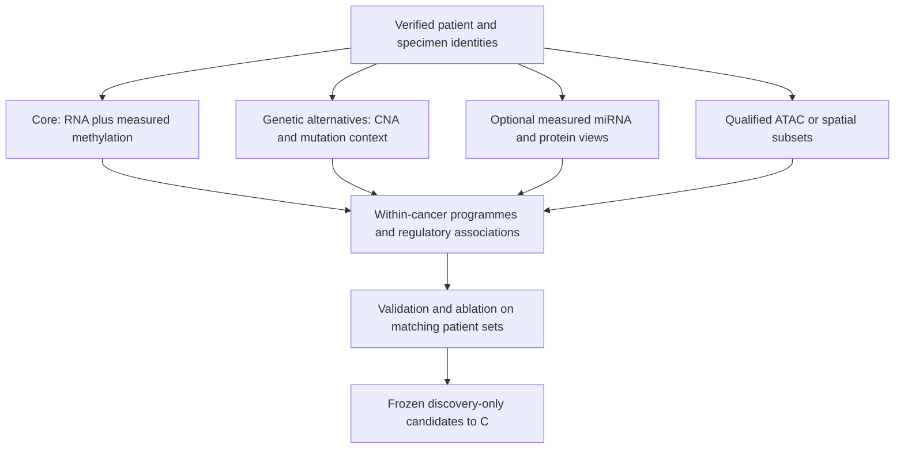

# B extension — Prostate-centred, stage-aware multi-omics

**Proposed extension, not a replacement of B-P.** The fixed APM programme, TCGA development/CPC-GENE external evaluation and its selected Delta_R2 remain governed by the existing B specification. New A-derived programmes, latent factors, additional cancers and clinical associations are separately registered exploratory/secondary analyses until reviewed. No CPC outcome can select the B-to-C discovery handoff.

## 1. The question TCGA can address

Where are the frozen ICI response-associated programmes represented in untreated or exposure-characterized tumour specimens, and what clinical, cellular, genetic and epigenetic measurements accompany their variation?

Apply A's frozen clinical-reference product to the **same cancer contexts first**, then to prespecified additional contexts, retaining prostate as the thesis centre. Gene coverage, assay scale, stage/site and treatment-history differences must be shown. A context selected because it is popularly called hot or cold is a discovery lead, not patient-level ground truth. The pan-cancer immune landscape is already extensively studied. [R9]

The output may be a continuous research score, similarity to the source response-associated pattern, or a validated model's transported numerical output with clear out-of-domain warnings. It is **not an observed TCGA response label or a calibrated probability of ICI benefit**. Do not label score-derived groups as confirmed responders/nonresponders, report their frequency as a clinical response rate, or use them to train a model and call that independent ICI validation. A score-only label predicted from RNA is especially circular as a target for an RNA-containing DIABLO model.

## 2. Clinical and specimen-state audit

Reconstruct patient -> sample -> portion/aliquot and diagnosis/treatment/sample timelines from the pinned GDC dictionaries, original clinical records and source publications. Preserve raw fields and mapping evidence. [R8,R9]

Required concepts, subject to source availability:

| Concept | Do not conflate it with |
|---|---|
| Stage at diagnosis | Stage at a later biopsy |
| Pathological/clinical TNM, grade, histology | A universal interchangeable ordinal stage across cancers |
| Primary, metastatic, recurrent or adjacent-normal specimen | Treatment-naive status |
| No prior ICI | No prior systemic therapy, radiotherapy or hormonal therapy |
| No treatment documented | Verified absence of treatment |
| Survival event/follow-up | ORR, durable benefit or treatment-attributable benefit |

Use `verified_no_prior_systemic_therapy`, `prior_systemic_therapy`, `unknown`, and separate modality-specific exposure fields. Record which evidence supports each status. A strict naive subset contains only verified cases; an unknown-history sensitivity is separately labelled. Do not exclude or reclassify patients on outcome-driven rules. Later stage cannot be invented from missing dates; preserve `stage_at_sampling=unknown`.

Prostate localized and metastatic/castration-resistant contexts need separate labels and appropriate clinical variables. A primary prostatectomy specimen does not establish the molecular state of a later treated metastasis.

## 3. Modality priorities, not an all-omics bottleneck

RNA+methylation is the principal molecular backbone. Add gene-level CNA and relevant mutation context to examine competing genetic explanations. Add miRNA, limited RPPA, qualified MS proteomics/phosphoproteomics or processed ATAC only where actual linked measurements and interpretation are available. ATAC measurements exist for a TCGA subset, not every case. CPTAC/HTAN resources require their own pairing/independence records. Do not substitute predicted protein/chromatin for a measured view. [R7–R10,R14,R19]

Report a modality-intersection/missingness chart and differences between complete and incomplete assay groups. An RNA-only study remains useful; a small protein subset does not set the RNA backbone N. Individual-level multi-omics requires supported sample alignment; unpaired cohorts can provide triangulation but cannot be concatenated into artificial patients.

## 4. MOFA2 versus DIABLO

**MOFA2/MOFA+: exploratory unsupervised integration.** Use it to summarize shared and view-specific variation and inspect factor loadings/variance explained. Start within cancer to avoid dominant lineage axes. A justified multi-group analysis is a later sensitivity, not permission to remove all cancer differences as batch. Missing assays can be accommodated in supported designs, but the degree of cross-view overlap and informativeness must be checked; it does not make completely unlinked modalities paired. [R13]

Pin feature transformations/selection, view scaling, likelihood, number-of-factor selection, seeds, convergence and stability checks before the declared confirmatory use. A factor may reflect purity, batch, lineage or missingness rather than epigenetic resistance. Factor sign is arbitrary until a declared orientation rule is applied. Associations discovered between fitted factors and outcomes in the same data are exploratory; external evaluation requires frozen loadings and a verified compatible projection procedure. Do not refit factors on the external cohort and call that validation of the original representation.

**DIABLO, implemented in mixOmics: supervised integration.** Use it only with a declared observed target and appropriately matched assay blocks. For actual ICI-response prediction it belongs to a qualifying paired ICI subset in A, with nested patient/study-held-out feature selection and tuning. In TCGA it may answer a separately defined clinical or molecular classification question, but not validate ICI response from inferred labels. mixOmics is the framework, not an additional independent method beside DIABLO. [R13]

Candidate multi-omics predictive comparisons must use the same eligible patients and identical splits for RNA-only and added-view models. Otherwise an apparent gain may reflect a different sample set. Do not compare an unvalidated multi-omics TCGA classifier with A's external ICI endpoint as though they were the same task. No deep model is necessary to execute this proposal.

## 5. Regulatory evidence beyond a single anticorrelation

For each development-nominated programme/gene preserve clinical association direction, prostate context, measured expression, promoter-CpG mapping, methylation effect and uncertainty, available CNA/genetic context, composition sensitivity and any direct chromatin/protein evidence. Test within cancers/specimen contexts before cross-cancer contrasts.

Promoter hypermethylation is one proposed mechanism. Domain-level hypomethylation-associated repression is a published prostate counterexample; miRNA regulation and histone-associated mechanisms are distinct. Beta arrays alone do not measure histone marks or demonstrate an enhancer-promoter link. Do not infer global epigenetic reversibility from MOFA loadings or a cross-sectional negative correlation. [R18]

Avoid algebraic circularity: selecting groups by an RNA score and then testing its own component genes between those groups does not independently validate the programme. Methylation/protein associations in the same selected groups remain observational and require appropriate selection/validation handling. Preserve continuous score analyses as the main characterization; any bins and their cutpoints are specified before outcomes and labelled descriptive when appropriate.

## 6. Clinical associations, not population epidemiology

Relate frozen programmes/factors to age, sex where variable, stage/grade, histology and available exposure variables under prespecified within-cancer models. Account for collinearity, missingness, sample ascertainment and test-family size. Do not substitute reported race for measured genetic ancestry, or interpret either as a causal genetic mechanism.

TCGA is not a population-representative survey. Frequencies in its selected samples do not estimate Egyptian/world prevalence, incidence, or the population fraction likely to benefit from ICI. Describe cohort-level clinicopathological associations. Survival analyses use source-supported disease-specific endpoints and follow-up, with event-count/precision and model-assumption checks; a prognostic association is not ICI treatment-effect prediction. [R9]

Primary biological inference stays prostate-centred. Additional cancers need a pre-analysis rationale and admitted source set, not post-hoc selection of the most impressive contrast. Use within-cancer continuous immune-state dimensions; spatially excluded and immune-desert claims require the corresponding spatial/abundance evidence, not just a universal high/low score threshold.

## 7. Validation and release

Validate new regulatory associations in independently sourced compatible prostate cohorts where feasible. CPC remains reserved according to the fixed B module's existing exposure policy; reusing its measurements for a new exploratory question must be declared and cannot feed back into the confirmatory feature set. No B patient shared with A's TCGA characterization becomes independent replication.

Deliver: clinical/specimen-state audit, modality intersections, assay-aware score coverage, continuous programme distributions, MOFA factor/QC report where feasible, separate supervised-model report only with an observed valid target, regulatory evidence table, genetic/composition sensitivities, and a TCGA-discovery-only handoff to C. Unavailable views remain missing, not simulated.
