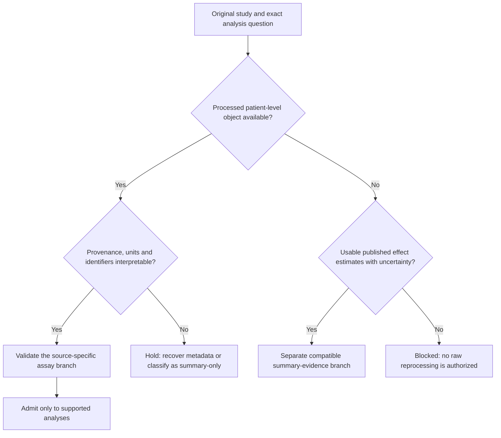

# Data contract: broad search, processed-first admission

**Proposal.** Search coverage is not study eligibility. Read [references and source leads](REFERENCES_AND_NOVELTY.md) and `source_search_plan.tsv`. No candidate added by this kit is an admitted study.

## 1. Acquisition architecture by paper

| Paper | Preserved starting points | Expansion question and candidate source families |
|---|---|---|
| A/A.1 | ICBatlas-first crosswalk; all 77 existing source references; recovered 47-row registry; GEO/ENA/SRA metadata; original publications | More independent baseline/longitudinal ICI studies; paired methylation/RNA; protein and single-cell/spatial evidence. Extend through TIGER, IOhub, Cancer-Immu and publication/supplement citation chasing. Atlas entries are leads, not independent validation. |
| B | GDC TCGA-PRAD/LUAD, CPC-GENE and original PCaDB cohorts | Qualified RNA/methylation/miRNA/CNA/mutation/protein intersections; measured ATAC subsets; independent prostate and comparator contexts; HTAN, processed single-cell portals and protein repositories. Verify every patient/specimen link. |
| C | TCGA-derived B handoff; LINCS/CMap; CCLE/DepMap; PRISM/GDSC; DrugBank/ChEMBL; Perturb-CITE-seq/SCP1064; TISMO; proposed LJP4 IFNG reference; GSE199800/GSE216053 | Measured epigenetic-drug RNA, methylation/chromatin, protein, viability and immune-function experiments in relevant contexts. Retain each original source's role and current access problem. Do not replace the architecture with one convenient dataset. |
| D | Existing supported-treatment/context-transfer task and checkpoint requirements | Independent, processed prostate perturbation measurements with auditable training overlap and compatible representation. A new catalogue is not an unseen benchmark. |

Resource-level expansion targets include GEO/BioStudies/ArrayExpress, authorized EGA/dbGaP routes, PDC/CPTAC, PRIDE/MassIVE, HTAN, Single Cell Portal and CELLxGENE. These are **search targets**; release, access, processed-object and endpoint coverage must be verified rather than assumed. TCGA RPPA is a limited antibody-based protein panel; do not relabel it full proteomics. CPTAC and spatial cohorts are not automatically TCGA-matched patients. [R7–R10, R14–R17]

## 2. Processed-first decision tree

Prefer original deposited processed objects. A processed integer count matrix is allowed; it is not a FASTQ workflow. GDC provides count and normalized expression products. [R7]

Normalized author matrices are not invalid merely because their authors already analysed them. Record quantification, transformation, batch correction, feature selection and whether labels or cross-cohort data entered preprocessing. A gene list selected using the same test patients cannot define the discovered features for that test. A normalized matrix with outcome-aware preprocessing cannot be advertised as an untouched independent test. Metadata inspection and outcome/model exposure are separate ledger fields.

Do not require raw reads to make a study novel. Do not reverse unknown transforms, round TPM into counts, rescale truncated FPKM into fabricated full-transcriptome TPM, derive missing detection P-values from beta values, or make zero stand for an unmeasured gene.

### Assay routes

| Input | Permitted proposed route | Important restriction |
|---|---|---|
| Author/GDC counts or supported estimated-count import | Count-aware DE or voom, with source-specific offsets/normalization | DESeq2 does not accept TPM as a substitute for counts. [R1] |
| Author normalized log RNA or array expression | Qualified limma analysis or documented score route | Exact log base, prior normalization and probe/gene mapping required; no blanket limma fallback for unknown input. [R2] |
| TPM/FPKM | Compatible scoring/prediction; separately specified normalized-expression association | Keep its effect scale separate from count-model logFC unless equivalence is justified. |
| Methylation beta/M values | Coverage-qualified association/composition branch | Identify platform, probes, build, prior QC and which QC cannot be repeated without IDAT. |
| Protein/phosphoprotein tables | Assay-specific abundance model | Olink NPX, MS intensity and RPPA are different scales; protein-group ambiguity, censoring and site/total-protein normalization remain explicit. |
| Processed scRNA/scATAC | Patient/specimen/cell-type aggregation or declared cell-state analysis | Count layers, QC and cell labels must be known; integrated embeddings are not raw counts. |
| Processed spatial data | Region/cell/spot abundance plus coordinates and pathology annotations | Without coordinates/regions, no spatial-exclusion claim; no raw-image segmentation by default. |
| Summary effects only | Separate compatible evidence synthesis | No patient-level prediction, deconvolution or artificial pairing from summary statistics. |

## 3. Identity model

Maintain separate tables: `studies`, `source_objects`, `subjects`, `specimens`, `assays`, `treatments`, `clinical_outcomes`, `pairing_links`, `overlap_edges`, `analysis_membership`, `exposure_ledger`. A source row never replaces this relational model.

The hierarchy is originating study/trial -> subject -> specimen/lesion -> collection time -> assay/aliquot -> processed object. IDs are strings. Preserve original identifiers and explicit crosswalk evidence. Same patient is not necessarily same lesion, same biopsy or same timepoint. TCGA case-level barcode matching alone does not establish identical biological material. [R8]

Pairing statuses: `same_specimen`, `same_patient_same_time_different_specimen`, `same_patient_different_time`, `unpaired`, `unknown`. Longitudinal pairing additionally requires the same patient, known order and treatment-relative dates. Blood RNA, tumour RNA and plasma proteins remain distinct compartments even when patient-linked.

Count and publish separate denominators for RNA, epigenetic, protein, linked patients, same-specimen pairs, longitudinal pairs, baseline eligible patients, outcome-evaluable patients, each model's complete-feature subset and final-test subset. Never report the largest modality count as the multi-omics sample size.

## 4. Required source and metadata fields

Every object needs originating study/trial identity, publication/accession, actual retrieval route, access/terms, version, retrieval timestamp, object type, bytes/hash when actually retrieved, assay/platform/build, feature IDs, scale/normalization, tissue/cell context and treatment/timepoint coverage. Missing hashes stay null. A landing-page retrieval is not a matrix download.

Clinical intake preserves raw and canonical response, assessment system, outcome window, evaluability, imaging versus clinical adjudication, drug components, doses where reported, line/prior exposure, cancer/subtype, lesion/site, stage at diagnosis and available stage at sampling. Pre-ICI is not synonymous with no prior systemic therapy. Unknown treatment history stays unknown.

Store study-level records in Git only when permitted. Patient-level crosswalks, expression/protein matrices and controlled objects stay in authorized project storage; publish retrieval manifests and permitted aggregate coverage. Never send patient data to a hosted MCP/model/deconvolution service without dataset-specific permission and explicit approval of that transfer.

`source_record.schema.json` validates candidate **source records**, not patient pairing or scientific admission. Full relational validation is an X2 deliverable.

## 5. Deduplication and exposure

Resolve atlas aliases, GEO/SRA/ENA links, trial publications, repeated sequencing, multiple lesions, cell-line releases and shared control experiments. Record definite overlap separately from suspected overlap. For final-test eligibility, unresolved material patient overlap is not evidence of independence.

Preserve raw legacy counts as historical statements, never accepted current N. Search for the historical analysis IDs `PRE_RESPONSE`, `ON_RESPONSE`, `POST_RESPONSE`, `TREATMENT_DELTA`, `DELTA_RESPONSE`, and `PAN_ICB_RESPONSE__PRE_TREATMENT`. Match their semantics before reuse. Reuse outputs only after the input/contrast/model membership hashes and provenance are established. Identical memberships and estimands must not become independent discoveries under two names.

## 6. Search completion rather than endless expansion

For each source family save query text, date, scope, original result IDs, pagination/completeness, screening decisions and full-text/data follow-up. Include all publication years relevant to the question, not only a recent-date filter. Complete the listed source families plus backward/forward citation tracing and a dated update search before final freeze. Record inaccessible/full-text-unresolved records. Do not call a convenience collection a systematic review.

The X1 report ranks next retrievals by the **question they resolve**, usable processed data, independent subjects/experiments, pairing quality and information gain. No invented weighted feasibility score and no effect-size-based selection. Broad source inventory can continue while a reviewed feasible core progresses.
